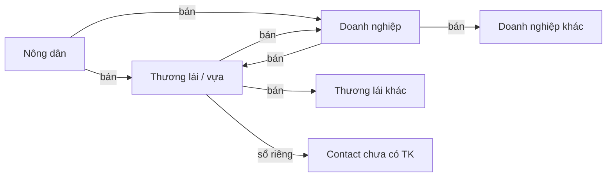

# 4. Domain model và user journeys

## 4.1 Bốn khái niệm không được gộp

| Khái niệm | Là gì | Không phải |
|---|---|---|
| **Login user** | `auth.users` + `profiles` | Quyền trên dữ liệu tổ chức |
| **Business profile** | `farmer` \| `trader` \| `enterprise` | Role membership |
| **Workspace** | Không gian làm việc / tổ chức, có `stable_code` | User |
| **Membership role** | `owner` `manager` `procurement` `sales` `warehouse` `accountant` `viewer` | Loại hồ sơ |

Một người có thể: sở hữu farm workspace **và** là `procurement` của enterprise workspace.

`platform_admin` / `support` / `moderator` **không** cấp qua form đăng ký.

## 4.2 Ba nhóm × hai chiều

**Sổ riêng (legacy + tiếp tục):** thương lái ghi phiếu với contact chưa mời. Đối tác **không** thấy. Khi liên kết tài khoản: lời mời + chấp nhận; không auto-map.

**Giao dịch chung:** một `trade_order` có đúng một seller party và một buyer party (workspace hoặc contact được liên kết). Bên bán nhìn “đơn bán”, bên mua nhìn “đơn mua” qua `workspace_order_views`. Giá vốn, ghi chú nội bộ, công nợ với bên thứ ba **không** nằm trên đơn chung.

## 4.3 Journeys P0

### Nông dân
1. Đăng ký → onboarding farmer → workspace hộ sản xuất (1-1 lúc đầu).
2. Hồ sơ trang trại (tọa độ **private** mặc định).
3. Khai lô thu hoạch / tin bán (lượng, phẩm cấp, cửa sổ giao).
4. Tìm điểm gần / bbox / không GPS (nhập địa điểm).
5. Follow điểm; gửi đề nghị/báo giá.
6. Chấp nhận điều khoản (đúng revision) → đơn.
7. Lịch giao/thu; theo dõi cân/QC; chấp nhận kết quả từng phần.
8. Xem phải thu / đã nhận / còn thiếu (theo xác nhận, không theo lời khai một phía).

### Thương lái
1. Tài khoản cũ → backfill workspace trader, membership owner.
2. Giữ: nháp, cân, công thức, phiếu sổ riêng, công nợ contact, tồn, Excel/PDF.
3. Thêm: điểm thu mua + bảng giá hiệu lực; nhu cầu mua; nhận tin nông dân; báo giá; lịch; nhận nhiều đợt; bán lại.
4. Contact chưa có TK vẫn ghi sổ riêng.

### Doanh nghiệp
1. Tạo workspace enterprise; mời thành viên; scope chi nhánh/kho.
2. **Mua:** buy request → so sánh báo giá cùng phẩm cấp/đơn vị/điều kiện → duyệt 1 bước (P0) → đơn → nhận từng phần → nhập kho → phải trả.
3. **Bán:** công bố lô → báo giá → giữ hàng → xuất từng phần → phải thu.
4. Owner tự duyệt đơn dưới hạn mức của chính owner; nhân viên không tự nâng hạn mức.

## 4.4 Lượng hàng — bốn số không trộn

| Số | Nghĩa | Dùng để |
|---|---|---|
| `estimated_qty` | Sản lượng dự kiến vụ | Tin tham khảo, không giữ chỗ |
| `harvested_qty` | Lô đã có | Trần bán |
| `reserved_qty` | Giữ chỗ còn hạn | Chống oversell |
| `delivered_qty` | Đã giao được chấp nhận | Giảm tồn người bán / tăng tồn người mua |

Hai accept đồng thời phần cuối: `SELECT … FOR UPDATE` trên `harvest_lots` / `inventory_lots` trong transaction xác nhận.

## 4.5 Tiền — ba lớp xác nhận

1. **Declared:** bên A khai đã chuyển (kèm ảnh biên lai tùy chọn).
2. **Counterparty confirmed:** bên B xác nhận đã nhận.
3. **Institutional:** đối soát ngân hàng (P0: thủ công admin/kế toán; **không** từ ảnh).

UI/API **cấm** hiện (1) như “đã đối soát”. Công nợ sổ riêng **không** mặc định thành nghĩa vụ bên kia.

## 4.6 Vòng đời tài khoản (identity)

| Bước | Đường | Ghi chú |
|---|---|---|
| Đăng ký Auth | supabase-js | email nội bộ hoặc recovery |
| Tạo profile + WS | `POST /me/onboarding` retry | **không** cùng TX SQL với Auth; job reconcile user không có WS |
| Chọn WS | header + last_selected | check membership mỗi request |
| Mời / accept / đổi role / khóa | invitations, memberships | khóa = revoke |
| Quên/đổi mật khẩu | Auth | — |
| Đổi SĐT/email | request + verify | P0 email; SĐT unverified đến P0.1 |
| Phiên / thiết bị | `devices` + revoke-all | Android keystore |
| Xóa | `deletion_requests` | §13; không cascade đơn WS |

Tài khoản cũ: **không** stamp verified; **không** khóa hàng loạt vì thêm OTP.

## 4.7 Phân biệt billing phần mềm

`subscriptions` / QR / Casso hiện tại = **thuê bao THUMUA365**. Entitlement sync. Nông dân P0 có quyền cơ bản xem đơn/tiền của mình **không** dính `has_active_sync` kiểu thương lái trả phí. A27.
