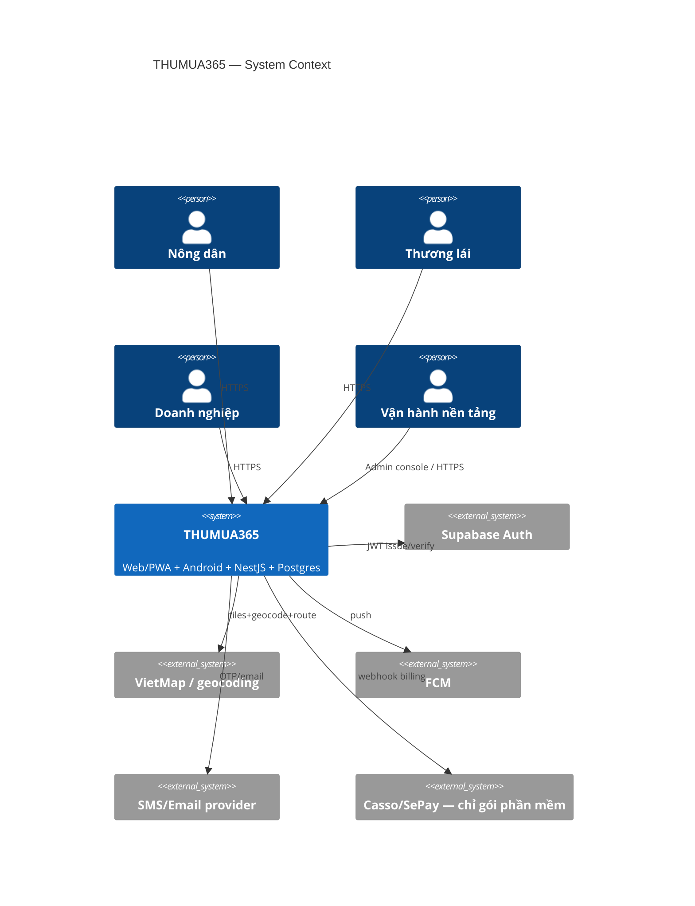
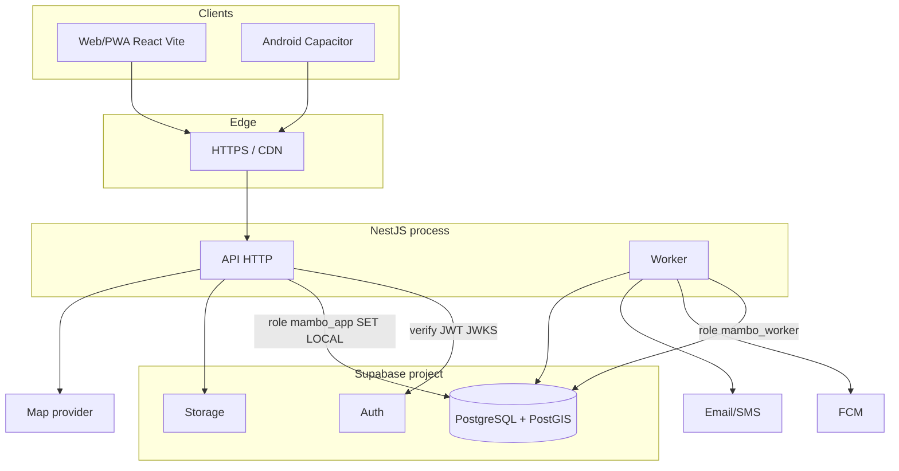
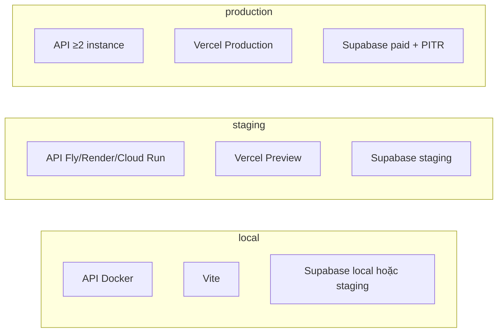

# 5. Kiến trúc và triển khai

## 5.1 C4 — Context



**Legend:** mũi tên vào `app` là tin cậy sau TLS + JWT. `bank` chỉ đụng module billing. Client **không** gọi Postgres qua service_role.

## 5.2 C4 — Container



API **stateless**. Worker đọc `outbox_events` cùng DB. Redis **tùy chọn** (rate limit, cache membership) — **không** lưu số dư tiền/tồn.

## 5.3 Triển khai



- Env tách credentials/Storage/DB.
- Migration = job CI riêng, **cấm** `synchronize: true` lúc boot NestJS.
- Frontend production **không** trỏ staging.

**Trust boundary:** mọi command đổi đơn/tiền/kho/quyền/hồ sơ xác minh đi NestJS. PostgREST chỉ còn: Auth, đọc bảng **được liệt kê** giai đoạn chuyển tiếp, Storage upload qua signed URL do NestJS cấp.

## 5.4 Ranh giới NestJS–Supabase

| Đường | Ai | RLS | Ghi bảng mới |
|---|---|---|---|
| Browser → Auth | supabase-js | n/a | không |
| Browser → PostgREST bảng cũ | anon/authenticated | `user_id` + `has_active_sync` | chỉ bảng legacy, feature-flag |
| Browser → NestJS | JWT | Nest SET LOCAL + RLS defense-in-depth | **bắt buộc** |
| Worker | `mambo_worker` | RLS + grant hẹp | outbox, cleanup, billing apply |
| Admin Auth API | service_role **chỉ** job isolated | bypass | audit bắt buộc; không có trong bundle |

Chi tiết grant/SET LOCAL: ADR-003.

## 5.5 Cấu trúc thư mục đề xuất

**Không** ép monorepo tooling ngay. Vite app **giữ root**. Thêm API cạnh:

```
/
  src/                    # web hiện tại
  apps/api/               # NestJS
    src/
      main.ts
      app.module.ts
      common/             # filters, decimal, idempotency, cls
      identity/
      access/
      workspaces/
      farms/
      catalog/
      locations/
      marketplace/
      quotations/
      orders/
      appointments/
      receiving/
      inventory/
      settlements/
      notifications/
      files/
      sync/
      reports/
      billing/
      moderation/
      audit/
    test/
  packages/contracts/     # OpenAPI generated types — optional khi có CI
  supabase/migrations/    # NGUỒN SỰ THẬT schema
  docs/backend-design/
```

Trong mỗi module NestJS:

- `*.controller.ts` — DTO in/out, không rule.
- `*.service.ts` — use case, transaction.
- `domain/` — state machine, money calc (port `core/calc` sang decimal).
- `infra/` — Drizzle repo, map adapter, FCM.

Cấm tầng “xxxRepository chỉ gọi service rồi return”.

Shared với frontend: **OpenAPI → types**, không import `apps/api` từ Vite.
