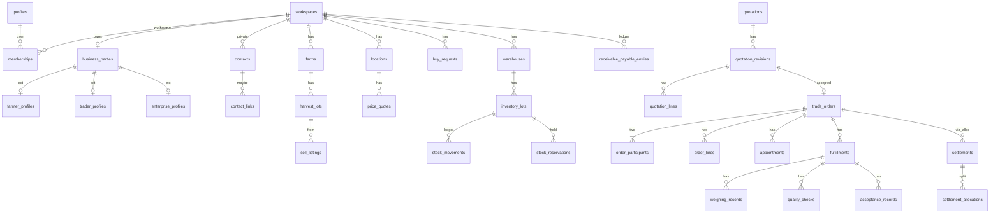

# 8. ERD và data dictionary P0

Quy ước mọi bảng P0 trừ ghi chú: `id uuid` PK (client có thể đề xuất; server **không** tin ownership), `created_at`/`updated_at timestamptz not null default now()`, `created_by`/`updated_by uuid` nullable (actor, **không** thay owner), `version int not null default 1` trên bảng sửa được. Xóa: tombstone `deleted_at` hoặc bảng append-only (ledger, audit, outbox, bank_transactions).

Tiền: `numeric(18,0)` cho VND đã làm tròn nghìn; `numeric(18,2)` cho đơn giá. Khối lượng: `numeric(18,3)`. Tỷ lệ: `numeric(7,4)` (30% = 0.3000 **hoặc** 30 với check 0–100 — **chốt:** lưu `numeric(6,2)` nghĩa là phần trăm 0–100 như client hiện tại, check `>=0 and <=100`). API decimal **string**.

Thời gian: lưu UTC `timestamptz`; hiển thị `Asia/Ho_Chi_Minh`; `business_date date` riêng khi cần ngày sổ; `device_recorded_at` vs `server_received_at` trên command.

JSONB: chỉ snapshot/metadata. Không nhét membership, nợ, kho vào JSON.

## 8.1 ERD (cardinality P0)



## 8.2 Dictionary P0

### Identity

**profiles** — mở rộng bảng hiện có. Owner: user. PK `id` → `auth.users`.  
Cột thêm P0: `phone_verified_at timestamptz null`, `email_verified_at timestamptz null`, `status text not null default 'active' check (active, disabled, pending_deletion, deleted)`, `locale text default 'vi'`.  
**Không** lưu password.  
Unique giữ `username`, `phone`.  
Xóa: không cascade chứng từ WS — xem §13.  
Truy cập: chủ hồ sơ; platform support có audit.

**identity_verifications** — mục đích xác minh cụ thể (`phone_otp`, `email`, `org_docs`). Cột: `user_id`, `kind`, `status` (pending/verified/rejected/expired), `evidence_file_id null`, `expires_at`, `verified_at`. Không yêu cầu CCCD đại trà.

**user_preferences** — 1-1 profile: display_mode, default_weight_unit, quiet_hours, locale.

**devices** — `user_id`, `device_id text`, `platform` web|android, `app_version`, `last_seen_at`, `revoked_at`, unique `(user_id, device_id)`.

### Access / workspace

**workspaces** — `code citext not null` unique ổn định (public slug nội bộ), `kind` personal_farm|trader|enterprise, `name`, `status` active|suspended|closed, `owner_user_id` (denormalized, nguồn sự thật = membership owner).  
Index `(kind, status)`.

**memberships** — `workspace_id`, `user_id`, `role_id`, `status` invited|active|revoked, `revoked_at`, unique `(workspace_id, user_id)`.  
FK composite pattern: `FOREIGN KEY (workspace_id) REFERENCES workspaces(id)`.

**membership_scopes** — `membership_id`, `scope_type` branch|warehouse, `scope_id uuid`. Unique `(membership_id, scope_type, scope_id)`. Rỗng = toàn WS (chỉ owner/manager).

**invitations** — `workspace_id`, `email_or_phone`, `role_id`, `token_hash`, `expires_at`, `accepted_at`, `invited_by`. Token raw chỉ gửi kênh, không lưu plaintext.

**roles** — seed: owner, manager, procurement, sales, warehouse, accountant, viewer. `workspace_id null` = system.

**permissions** — `code text pk` ví dụ `orders.accept`, `settlements.reverse`.  
**role_permissions** — `(role_id, permission_code)`.

### Business parties

**business_parties** — `workspace_id unique`, `display_name`, `legal_name null`, `tax_code null`, `kind` farmer|trader|enterprise. Đây là party trên đơn.

**farmer_profiles** — `party_id pk`, `household_size null`, `primary_crops text[]`.

**trader_profiles** — `party_id pk`, `trade_name`, `legacy_user_id uuid null` (map tài khoản cũ).

**enterprise_profiles** — `party_id pk`, `registration_no null`.

### Contacts (sổ riêng)

**contacts** — `workspace_id not null`, `kind` supplier|buyer|both, `name`, `phone`, `location_text`, `note`, `linked_party_id null`. Unique `(workspace_id, id)`.  
Index `(workspace_id, name)`.  
**Không** đưa lên map.

**contact_links** — `contact_id`, `party_id`, `status` pending|accepted|rejected, `accepted_at`. Chỉ accepted mới nối đơn chung.

### Sản xuất P0 tối thiểu

**farms** — `workspace_id`, `name`, `address_text`, `geog geography(Point,4326) null`, `geo_visibility` hidden|approximate|exact_to_counterparty|public (default hidden).

**harvest_lots** — `farm_id`, `workspace_id` (denorm + FK composite), `commodity_id`, `grade_id null`, `estimated_qty numeric(18,3)`, `harvested_qty`, `reserved_qty default 0`, `delivered_qty default 0`, `status` open|closed, check `reserved_qty + delivered_qty <= harvested_qty` (estimated không tham gia).  
`plots`, `crop_seasons`: **P1** (có thể thêm không chặn P0).

### Catalog

**commodities** — platform: `code`, `name_vi`, `crop` rubber|cashew|coffee|pepper|other.

**grades** — `commodity_id`, `code`, `name`.

**units** — `code` kg|hg, `to_kg numeric`.

**workspace_products** — map `products` cũ: `workspace_id`, `commodity_id null`, `local_name`, `formula_type`, `track_inventory`, `legacy_product_id`. **Không** dùng tên làm khóa. Unique `(workspace_id, id)`.

### Locations

**branches** — `workspace_id`, `name`, `address`. Chi nhánh ≠ luôn là điểm mua.

**locations** — `workspace_id`, `branch_id null`, `type` procurement_point|warehouse|delivery|farm_gate, `name`, `address_text`, `address_normalized null`, `admin_area_version int`, `geog geography(Point,4326) not null` khi published, `public_contact_name`, `public_phone`, `verification_status` unverified|verified|rejected, `publish_status` draft|pending_review|published|rejected|suspended|closed, `rejection_reason null`.  
GiST index `locations_geog_gix on locations using gist(geog)`.  
Check published ⇒ geog not null.

**location_hours** — `location_id`, `weekday 0-6`, `open_time`, `close_time`, `timezone` default `Asia/Ho_Chi_Minh`, `is_closed`. Exception table `location_hour_overrides` (date, closed/open).

**procurement_capabilities** — `location_id`, `commodity_id`, `grade_id null`, `min_qty`, `max_qty null`, `pickup_available boolean`.

**price_quotes** (bảng giá điểm, **không** phải quotation thương mại) — `location_id`, `workspace_id`, `commodity_id`, `grade_id`, `unit`, `price numeric(18,2)`, `price_kind` reference|conditional_commit, `valid_from timestamptz`, `valid_to timestamptz null`, `conditions jsonb snapshot`. Index `(location_id, commodity_id, valid_from desc)`. Giá hết hạn **cấm** trả như current.

### Marketplace

**sell_listings** — `workspace_id`, `harvest_lot_id null`, `commodity_id`, `qty`, `unit`, `desired_price null`, `negotiable boolean`, `window_start/end`, `delivery_mode` pickup|dropoff|either, `location_id null`, `status` draft|published|paused|fulfilled|expired|cancelled, `expires_at`.

**buy_requests** — đối xứng phía mua.

**listing_media** — `listing_id`, `file_id`.

**follows** — `user_id`, `location_id`, unique pair.

### Quotations

**quotations** — `id`, `listing_id null`, `buy_request_id null`, `from_party_id`, `to_party_id`, `current_revision_id`.

**quotation_revisions** — immutable khi `status` ∈ sent|accepted|rejected. `quotation_id`, `revision_no int`, `status` draft|sent|countered|accepted|rejected|expired|withdrawn, `expires_at`, `payload_hash`. Unique `(quotation_id, revision_no)`.

**quotation_lines** — thuộc revision, snapshot commodity/grade/qty/price/unit.

Accept **phải** gửi `revision_id` khớp current sent/countered.

### Orders

**trade_orders** — `status` draft|pending_acceptance|confirmed|in_fulfillment|completed|cancelled, `source_quotation_revision_id`, `buyer_party_id`, `seller_party_id`, `confirmed_at`, `completed_at`, `document_no` cấp server (offline temp_no riêng), `terms_snapshot jsonb`, `version`. Check `buyer_party_id <> seller_party_id`. Unique `(workspace_id_of_issuer, document_no)` **sau** cấp số — số chính thức chỉ khi online.

**order_lines** — snapshot names, formula, inputs, unit price, rounding rule.

**order_participants** — `order_id`, `party_id`, `workspace_id`, `side` buyer|seller. Unique `(order_id, side)`.

**order_events** — append-only: actor, type, payload, at.

**workspace_order_views** — `workspace_id`, `order_id`, `direction` inbound|outbound, `internal_status`. Unique pair.

**internal_notes** — `workspace_id`, `order_id`, body. Không replicate đối tác.

**approval_requests** / **approval_actions** — P0 một bước: `resource_type`, `resource_id`, `revision`, `amount`, `status` pending|approved|rejected|revoked. Check approver ≠ requester trừ rule owner-own-limit.

### Appointments & receiving

**appointments** — `order_id`, `location_id`, `proposed_at`, `status` proposed|confirmed|rescheduled|checked_in|completed|cancelled|no_show, `counter_version`.

**fulfillments** — `order_id`, `appointment_id null`, `sequence`, `expected_qty`, `status` expected|weighed|qc|accepted|partially_accepted|rejected.

**weighing_records** — gross, tare, formula snapshot, `physical_qty`, `payable_qty` (net), device_recorded_at.

**quality_checks** — grade proposed/accepted, reason, `accepted_by_seller`, `accepted_by_buyer`.

**acceptance_records** — qty accepted, qty rejected, reason. P1: returns sau accept.

### Inventory

**warehouses** — `workspace_id`, `location_id null`, `name`.

**inventory_lots** — `warehouse_id`, `workspace_id`, `commodity_id`, `grade_id`, `qty_on_hand`, `qty_reserved`, `qty_available` generated hoặc check `on_hand - reserved >= 0`, `origin` harvest|purchase|legacy_opening, `legacy_product_name null`. P1: split/merge lineage.

**stock_movements** — append-only: `lot_id`, `qty signed`, `reason` receive|ship|adjust|reverse, `fulfillment_id null`, `actor_id`. **Không** update qty movement.

**stock_reservations** — `lot_id` hoặc `harvest_lot_id`, `order_id`, `qty`, `status` active|released|consumed|expired, `expires_at`. Unique active overlap handled in TX.

### Settlements

**receivable_payable_entries** — sổ nội bộ WS: `workspace_id`, `contact_id null`, `party_id null`, `side` receivable|payable, `amount`, `source` legacy_receipt|trade_order|manual, `source_id`, `status` open|closed. Derived remaining từ allocations − reversals.

**settlements** — một khoản tiền: `workspace_id`, `direction` in|out, `amount > 0`, `status` declared|posted|rejected|reversed, `declared_by`, `value_date`, `due_date null`.

**settlement_confirmations** — `settlement_id`, `kind` counterparty|institutional, `by_user_id`, `at`.

**settlement_allocations** — `settlement_id`, `entry_id` hoặc `order_id`, `amount > 0`. Check tổng alloc ≤ settlement available.

**reversals** — `target_type`, `target_id`, `reason`, `actor_id`, `at`. Không sửa row gốc.

### Files / notifications

**files** — `status` pending|ready|rejected, `bucket`, `storage_key` server-generated, `mime`, `byte_size`, `uploader_id`, `sha256 null`.

**file_links** — `file_id`, `resource_type`, `resource_id`, `workspace_id`.

**notification_inbox** — durable; `user_id`, `type`, `title`, `body_safe` (không PII nhạy cảm lock-screen), `read_at`, `dedup_key`.

**notification_preferences** — per type, quiet hours.

**push_registrations** — `user_id`, `device_id`, `platform`, `provider` fcm, `token`, `app_version`, `locale`, `permission`, `last_seen_at`, `revoked_at`. Unique token. Rotate/xóa token chết. Không gửi user cũ trên máy mới.

### Moderation / infra / billing

**verification_cases**, **reports**, **disputes**, **moderation_actions** — evidence_file_ids, assignee, result. Disputes **song song** order, không xóa lịch sử nhận hàng.

**audit_events** — append-only, no update grant to `mambo_app`. `actor_id`, `action`, `resource`, `diff jsonb`, `request_id`.

**outbox_events** — `id bigint identity`, `topic`, `payload jsonb`, `status` pending|processing|done|dead, `attempts`, `available_at`.

**idempotency_records** — `workspace_id`, `actor_id`, `command_type`, `key`, `request_hash`, `response jsonb`, `created_at`. Unique `(workspace_id, actor_id, command_type, key)`. TTL cache response 24h **cột riêng**.  
**idempotent_operations** — `operation_id uuid pk` hoặc unique `(workspace_id, operation_id)` **không TTL** cho lệnh tiền/kho.

**sync_operations** — audit lệnh sync.

**change_feed** — `id bigint generated always as identity primary key`, `workspace_id`, `aggregate_type`, `aggregate_id`, `op` upsert|delete|reverse, `payload jsonb` (projection được phép), `actor_id`, `committed_at default now()`. Cursor = `id`, không phải timestamp. Index `(workspace_id, id)`.

**plans**, **subscriptions** (evolve bảng cũ: thêm `workspace_id`; backfill 1-1 user trader), **entitlements**, **billing_events**. Namespace tách settlements.

## 8.3 Constraint chống chéo workspace

Mọi child nội bộ:

```sql
-- mẫu: inventory_lots thuộc đúng warehouse cùng workspace
foreign key (warehouse_id, workspace_id)
  references warehouses (id, workspace_id);
```

`warehouses` có `unique (id, workspace_id)`.

Số chứng từ: `unique (workspace_id, book_year, document_no)` cấp bằng `UPDATE ... RETURNING` trên `document_sequences` (hàng khóa). Offline: `temp_document_no` unique theo device, **không** hứa số chính thức liên tục.

Địa chỉ hành chính: `admin_area_versions` + `admin_areas (code, version, name)` — không hard-code tỉnh mãi.

## 8.4 Bảng bất biến vs sửa vs tombstone

| Loại | Bảng |
|---|---|
| Append-only | stock_movements, order_events, audit_events, change_feed, reversals, weighing_records sau confirm, quotation_revisions sau sent |
| Sửa + version | trade_orders, listings, locations, memberships |
| Tombstone | contacts, files metadata, listings |
| Legacy giữ | `transactions`, `payments`, `suppliers`, `buyers`, `products`, `drafts` |

## 8.5 P1/P2 (không implement P0)

P1: `stock_transfers`, `stocktakes`, `return_orders`, `aging_snapshots`, `conversations`.  
P2: `shipments`, `iot_weigh_events`, `bom`, `trace_events`.
