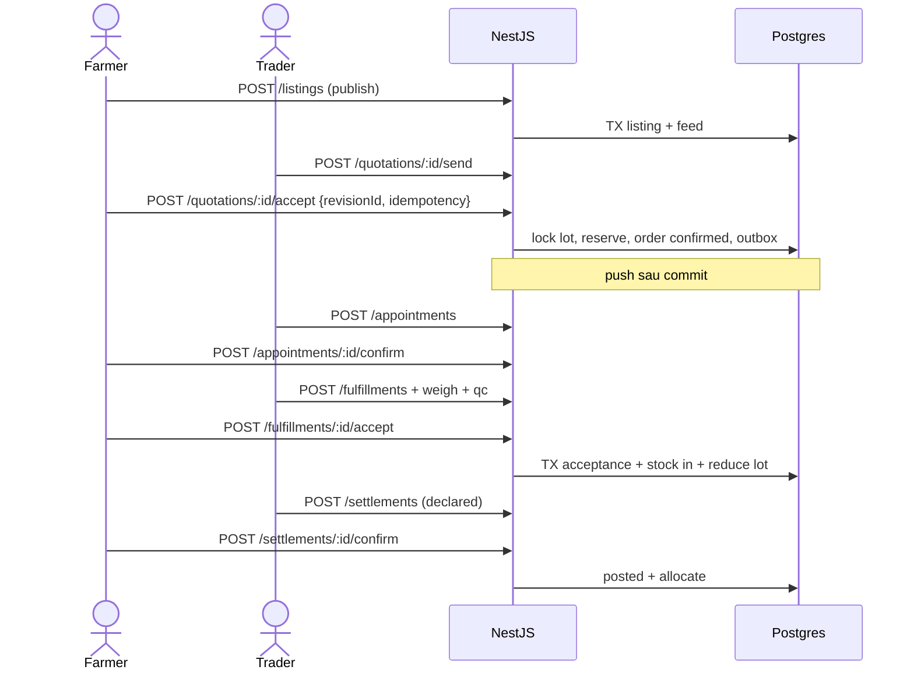
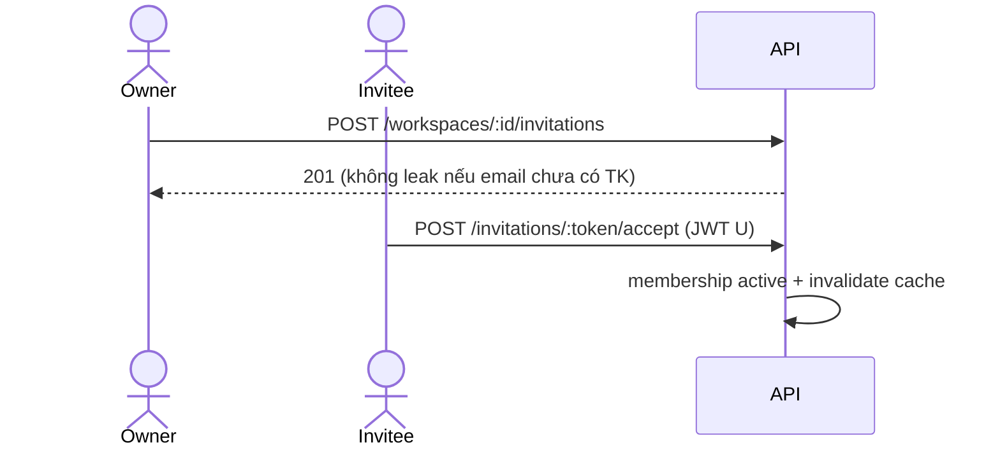
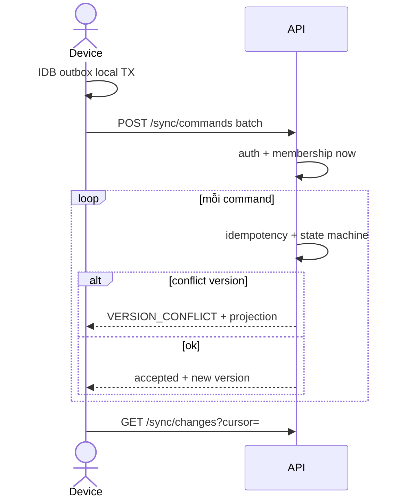

# 9. State machines và sequence diagrams

Cột `status` **không** gộp đơn + giao hàng + tiền + tranh chấp. Trạng thái trả tiền **suy** từ ledger, client không `PATCH paid`.

`completed` trên đơn = hàng đã chấp nhận đủ (hoặc đóng phần còn lại có đồng ý hai bên). **Công nợ có thể còn**. Không đóng đơn bằng cách xóa fulfillment.

## 9.1 Listings / buy_requests

`draft → published → paused → published`; `published → fulfilled | expired | cancelled`.

| Transition | Actor | Điều kiện | Input | Side effect | Lỗi |
|---|---|---|---|---|---|
| publish | owner listing | membership; farmer unverified → vẫn publish nhưng badge unverified; qty ≤ harvested − reserved | payload | change_feed, notify follows nếu điểm | `VALIDATION_FAILED` |
| pause | owner | published | — | — | `INVALID_STATE_TRANSITION` |
| expire | worker | expires_at < now() | — | release holds gắn listing | retry worker |

## 9.2 Quotations

`draft → sent → countered → sent`; `sent|countered → accepted|rejected|expired|withdrawn`.

Accept: `revision_id == current` AND status ∈ {sent, countered} AND now < expires_at AND party = to_party (hoặc from khi counter). **Cùng TX:** lock listing/lot, tạo `trade_orders` pending_acceptance hoặc confirmed (nếu policy auto), tạo reservation, outbox.

Mã: `QUOTE_EXPIRED`, `VERSION_CONFLICT`.

## 9.3 Trade orders

`draft → pending_acceptance → confirmed → in_fulfillment → completed`; nhánh `cancelled` từ pending/confirmed nếu chưa nhận hàng (sau nhận: cancel phần còn lại, không xóa lịch sử).

Dispute: bảng `disputes.status` open|resolved, **không** ghi đè order.status.

| Transition | Actor | Điều kiện | TX | Retry |
|---|---|---|---|---|
| confirm | phía còn lại / cả hai theo terms | expectedVersion; stock/lot đủ | reserve + status + outbox | idempotent operation_id |
| cancel | participant + quyền | không có acceptance posted; hoặc cancel remainder | release reservation | — |
| complete | system khi accepted_qty ≥ ordered **hoặc** close_remainder 2 bên | nợ không chặn | — | — |

Hai người accept phần lượng cuối: `SELECT harvest_lots WHERE id=$1 FOR UPDATE`; check `harvested - reserved - delivered >= qty`.

Giữ chỗ: lúc accept quote/confirm order. TTL mặc định **48h** nếu chưa `appointment.confirmed` (cấu hình WS). Hết hạn: worker release, notify, **không** last-write-wins. Đổi qty: tạo change request, bên kia accept; không tự tăng reservation.

## 9.4 Appointments

`proposed → confirmed → checked_in → completed`; `confirmed → rescheduled` (phiên bản mới, cái cũ `superseded`); `→ cancelled | no_show`.

Reschedule: actor đúng bên, `expectedVersion`.

## 9.5 Fulfillment / receiving

`expected → weighed → qc → accepted | partially_accepted | rejected`.

P0: từ chối cả lô hoặc nhận một phần. P1: return sau accepted.

Chỉ `acceptance_records` **posted** mới `stock_movements` nhập. Đặt đơn/lịch **không** tăng `qty_on_hand`. Reservation ≠ xuất kho.

Sai số cân: `abs(physical − expected) / expected ≤ threshold` (mặc định 2%, cấu hình WS) hoặc warehouse ghi lý do `over_accept` cần manager.

Đảo nhận đã dùng cho xuất: không xóa movement; tạo reverse movement + chặn nếu `qty_available` không đủ — bắt buộc xử lý phụ thuộc (P0: reject reverse với `INVALID_STATE_TRANSITION` + hướng dẫn xuất reverse trước).

## 9.6 Settlements

`declared → posted | rejected`; `posted → reversed` (tạo reversal + bút toán ngược, gốc immut).

Allocated remaining = amount − sum(alloc) + sum(reverse alloc). Hai allocate song song: `SELECT settlement FOR UPDATE`.

## 9.7 Location publish

`draft → pending_review → published`; `→ rejected | suspended | closed`. Đổi geog/phone nhạy cảm khi published → `pending_review` lại.

## 9.8 Sequence — nông dân bán thương lái

Nông dân → doanh nghiệp: giống, buyer = enterprise, approval_request nếu vượt hạn mức procurement.

Thương lái → doanh nghiệp / DN → DN: thêm `approval_requests` P0 một bước phía DN mua.

## 9.9 Sequence — mời thành viên

## 9.10 Sequence — sync sau mất mạng

Lỗi giữa local save và send: outbox còn, retry cùng operationId.

## 9.11 Sequence — khiếu nại

Farmer `POST /disputes` trên order in_fulfillment/completed. Order không `cancelled` tự động. Moderator/các bên thêm evidence. Resolve: adjustment settlement hoặc reverse acceptance theo rule P0 (chỉ nếu hàng chưa xuất tiếp).

## 9.12 Sequence — xóa tài khoản nhân viên vs owner

Nhân viên: re-auth → `deletion_requests` → revoke sessions → anonymize profile → **không** xóa orders WS.  
Owner: phải `transferOwner` hoặc `closeWorkspace` trước. A20. Chi tiết §13.

## 9.13 Transaction / concurrency / retry

| Lệnh | Khóa | Idempotency bền | Retry worker |
|---|---|---|---|
| accept quote | lot FOR UPDATE | operation_id unique | không tạo order lần 2 |
| accept goods | fulfillment + lot | operation_id | không double movement |
| allocate | settlement FOR UPDATE | operation_id | không vượt số dư |
| notify | outbox row | outbox id | không ghi tiền |

Optimistic: `expectedVersion` / `If-Match`. Conflict → `VERSION_CONFLICT`, không LWW tiền/kho/status.

## 9.14 Ledger MVP — không gọi là kế toán kép

Sổ **đơn** vận hành: `receivable_payable_entries` + `settlements` + allocations. Đủ A11–A13. Không journal debit/credit đầy đủ. Báo cáo truy về `source_id`. Phân biệt draft local vs posted server.
